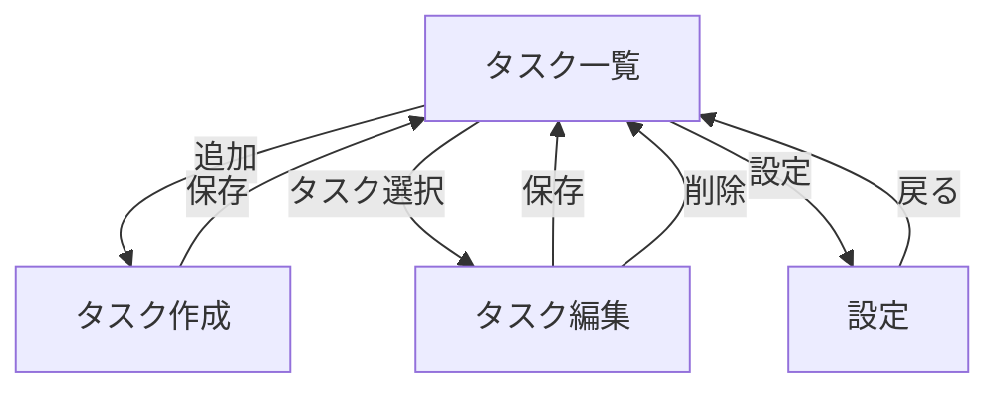
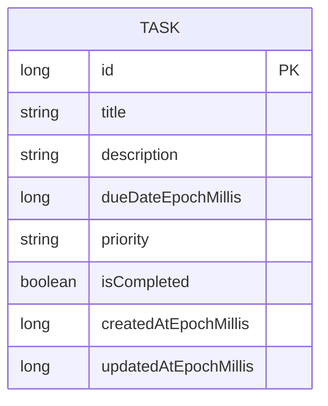
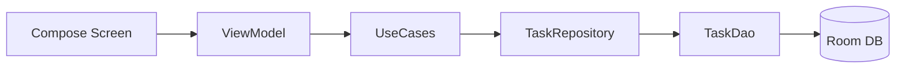

# Kotlin学習 + Androidアプリ開発ドキュメント

## 1. このドキュメントの目的

Kotlin学習からAndroidアプリ開発までの流れを、実装しながら学べる形でまとめる。

- 期間: 12週間
- 学習時間目安: 平日1時間 + 週末2〜3時間
- 最終ゴール: 公開可能レベルのAndroidアプリを1本完成

---

## 2. 学習ロードマップ（12週間）

### Phase 1: Kotlin基礎（1〜3週）

#### 1週目

- 変数、型、if、when、for、while
- 関数、引数、戻り値
- ミニ課題: 電卓CLI、ToDoの文字列管理

#### 2週目

- クラス、データクラス、継承、インターフェース
- null安全、例外処理
- ミニ課題: ユーザー管理クラス、バリデーション

#### 3週目

- コレクション（List/Map/Set）
- ラムダ、拡張関数、スコープ関数（let/apply/run）
- ミニ課題: ToDo検索、並び替え、フィルタ

到達目標:

- Kotlinで小さなロジックを自力で書ける

### Phase 2: Android基礎（4〜6週）

#### 4週目

- Android Studio操作
- Activity、Fragment、ライフサイクル
- 画面遷移とIntent
- 課題: 2画面アプリ作成

#### 5週目

- Jetpack Compose基礎
- 状態管理（State、remember、state hoisting）
- 入力フォーム、リスト表示
- 課題: メモ入力・一覧アプリ

#### 6週目

- アーキテクチャ入門（MVVM）
- ViewModel、StateFlow
- 課題: Compose + ViewModel構成へ改善

到達目標:

- ComposeでUIを組み、状態を適切に管理できる

### Phase 3: 実用機能（7〜9週）

#### 7週目

- ローカル保存（Room）
- 非同期処理（Coroutines）
- 課題: ToDoデータ永続化

#### 8週目

- ネットワーク通信（Retrofit + Kotlinx Serialization）
- ローディング・エラー表示
- 課題: 外部APIを使った一覧表示

#### 9週目

- DI入門（Hilt）
- Repositoryパターン
- 課題: データ層整理

到達目標:

- 保存・通信・非同期を含む実用アプリを作れる

### Phase 4: 仕上げ（10〜12週）

#### 10週目

- テスト基礎（Unit Test）
- ViewModelの入力/状態遷移テスト

#### 11週目

- UI改善、アクセシビリティ、エラーハンドリング
- パフォーマンス確認

#### 12週目

- リリース準備（アイコン、バージョン、署名）
- README、スクリーンショット、紹介文整備

到達目標:

- ポートフォリオとして提示可能な完成度にする

---

## 3. 最終制作アプリの方針

候補:

- タスク管理アプリ
- 家計簿アプリ
- 習慣トラッカー

推奨:

- タスク管理アプリ（CRUD、保存、状態管理、UI改善を一通り学べるため）

---

## 4. タスク管理アプリ設計図

## 4.1 目的

- 毎日のタスクを素早く記録し、期限と優先度で管理する
- 学習目的としてCompose、MVVM、Room、StateFlowを実践する

## 4.2 想定ユーザー

- 個人利用の初心者〜中級者
- 仕事・勉強のやることをシンプルに管理したい人

## 4.3 機能要件

- タスク追加・編集・削除
- 完了/未完了の切替
- 期限設定
- 優先度設定（高・中・低）
- タイトル検索（部分一致）
- 並び替え（期限順・優先度順・作成日順）
- フィルタ（未完了のみ、今日期限のみ）
- ローカル保存（オフライン対応）

## 4.4 画面構成

### タスク一覧画面

- 一覧表示（カード形式）
- 検索バー
- フィルタ/ソート操作
- 追加用FAB

### タスク作成/編集画面

- 入力項目: タイトル、詳細、期限、優先度
- 保存ボタン
- 編集時のみ削除ボタン

### 設定画面（任意）

- デフォルト並び順
- 完了タスクの表示/非表示

## 4.5 画面遷移



## 4.6 データ設計（Room）

Entity: Task

- id: Long（PK）
- title: String
- description: String
- dueDateEpochMillis: Long?
- priority: String（HIGH / MEDIUM / LOW）
- isCompleted: Boolean
- createdAtEpochMillis: Long
- updatedAtEpochMillis: Long



## 4.7 アーキテクチャ

- UI: Jetpack Compose
- Presentation: ViewModel + StateFlow
- Domain: UseCase（任意）
- Data: Repository + Room DAO



## 4.8 UI状態設計（例）

TaskListUiState:

- tasks: List<Task>
- query: String
- currentFilter: FilterType
- currentSort: SortType
- isLoading: Boolean
- errorMessage: String?

## 4.9 バリデーション

- タイトル必須（1文字以上）
- タイトル最大長（例: 60文字）
- 詳細最大長（例: 500文字）
- 期限が過去日の場合は保存可 + 警告表示（学習用途に適する）

## 4.10 非機能要件

- 起動3秒以内（一般端末）
- 1000件程度で実用的にスクロールできる
- 空入力や異常入力でクラッシュしない

## 4.11 テスト最小セット

- ViewModelテスト
  - 追加で一覧に反映される
  - 検索で絞り込まれる
  - 完了切替が反映される
- DAOテスト
  - insert後に取得できる
  - update/deleteが反映される

## 4.12 実装順序（推奨）

1. Task Entity + DAO + Database
2. Repository
3. 一覧画面（表示のみ）
4. 追加機能
5. 編集・削除機能
6. 検索・フィルタ・ソート
7. テスト追加
8. UI調整

---

## 5. 週次の進め方テンプレート

- インプット 30%: 公式ドキュメントや教材を学ぶ
- アウトプット 70%: 毎週1機能を必ず完成
- 振り返り: 詰まった点を3つ書き、翌週開始時に復習

---

## 6. 次に着手する内容（このプロジェクト向け）

- Room導入（Task Entity / DAO / Database）
- タスク一覧画面の土台（Compose + ViewModel + StateFlow）
- 追加画面の作成（バリデーション込み）

---

## 7. 今から進める2週間プラン

「カリキュラムを進める」ために、まずは直近2週間を固定する。

### Week 1（Kotlin基礎の実装週）

#### Day 1

- Kotlin基本文法の復習（変数、if、when、for）
- 30分で小課題: `when` を使った簡易メニュー処理

#### Day 2

- 関数、引数、戻り値、デフォルト引数
- 30分で小課題: 文字列タスクの追加/削除関数を作る

#### Day 3

- データクラス、null安全、例外処理
- 30分で小課題: Taskモデルと入力バリデーション関数を作る

#### Day 4

- List/Map、filter/map/sortedBy
- 30分で小課題: タスク検索・並び替え処理

#### Day 5

- スコープ関数（let/apply/run）
- 30分で小課題: Task生成と更新ロジックを整理

#### 週末

- 1時間: 1週間分の小課題を1つのKotlinファイルに統合
- 1時間: 分からなかった点をメモして復習

### Week 2（Android基礎へ接続）

#### Day 1

- Activityライフサイクルを整理
- 既存画面のイベント処理を読み解く

#### Day 2

- 画面設計の見直し（一覧画面に必要な要素を箇条書き）
- `TaskListUiState` の項目を確定

#### Day 3

- Room導入の準備（依存関係の整理）
- Task Entityの項目最終確定

#### Day 4

- DAOインターフェースの設計
- insert/update/delete/getAllのI/Oを定義

#### Day 5

- AppDatabase設計
- データ層の責務（Repository）を文章化

#### 週末

- 1時間: ここまでの設計を見直して不足を補う
- 1時間: Week 3で実装する順序を確定

---

## 8. 進捗チェックリスト

### Kotlin基礎チェック

- [ ] if / when を自力で使える
- [ ] データクラスを定義できる
- [ ] null安全演算子を使い分けできる
- [ ] Listをfilter/sortできる
- [ ] 関数を分割してロジック整理できる

### Android導入チェック

- [ ] Activityとライフサイクルの役割を説明できる
- [ ] 1画面に必要なUI要素を分解できる
- [ ] ViewModelを使う理由を説明できる
- [ ] RoomのEntity/DAO/Databaseの役割を説明できる

---

## 9. 学習ログテンプレート

毎日の最後に3分で記録する。

```text
日付:
やったこと:
できるようになったこと:
詰まったこと:
明日やること:
```

このログを残すと、復習と質問が速くなる。

---

## 10. 実装マップ（どこに何を書くか）

このプロジェクトで最初に作る「タスク一覧 + 保存」の実装先を固定する。

### 10.1 依存関係設定

対象ファイル:

- gradle.properties
- build.gradle.kts（ルート）
- app/build.gradle.kts
- gradle/libs.versions.toml

ここで追加する内容:

- Kotlin Androidプラグイン
- KSPプラグイン
- Room（runtime / ktx / compiler）
- Lifecycle（viewmodel-ktx / runtime-ktx）
- RecyclerView

AGP 9系での注意点:

- AGP 9.0以降は「組み込みKotlinサポート」と「新DSL」がデフォルト有効になっており、このプロジェクトで使うKotlin 2.2.10 + KSP 2.2.10-2.0.2の組み合わせでは明示的な`kotlin-android`プラグインと競合する
- gradle.propertiesに次の2行を追加して、旧来の方式に固定する

```properties
android.builtInKotlin=false
android.newDsl=false
```

- ルートのbuild.gradle.ktsにも`kotlin-android`と`ksp`を`apply false`で宣言しておく

### 10.2 データ層（Room）

新規フォルダ:

- app/src/main/java/com/example/myfirsttoolapp/data/local

新規ファイル:

- TaskEntity.kt
  - テーブル定義（id, title, description, dueDateEpochMillis, priority, isCompleted, createdAtEpochMillis, updatedAtEpochMillis）
- TaskDao.kt
  - insert / update / delete / getAll を定義
- AppDatabase.kt
  - RoomDatabase定義、TaskDao取得関数

### 10.3 Repository層

新規フォルダ:

- app/src/main/java/com/example/myfirsttoolapp/data/repository

新規ファイル:

- TaskRepository.kt
  - DAOを呼び出して、UI側に渡す操作をまとめる
  - 最初は addTask / getAllTasks / toggleCompleted / deleteTask の4操作で開始

### 10.4 Presentation層（ViewModel）

新規フォルダ:

- app/src/main/java/com/example/myfirsttoolapp/ui/tasklist

新規ファイル:

- TaskListUiState.kt
  - tasks, query, currentFilter, currentSort, isLoading, errorMessage
- TaskListViewModel.kt
  - Repository呼び出し
  - 画面イベント（追加、完了切替、削除）を処理
  - UiStateを更新

### 10.5 画面（既存ファイルの置き換え）

既存更新ファイル:

- app/src/main/java/com/example/myfirsttoolapp/MainActivity.kt
  - 現在のカウンター処理を削除
  - ViewModelと画面部品を接続

- app/src/main/res/layout/activity_main.xml
  - 画面をタスク管理UIへ変更
  - 最小構成: タイトル入力、追加ボタン、RecyclerView

### 10.6 そのままでよいファイル

- app/src/main/AndroidManifest.xml
  - MainActivity起動設定は既にあるため、最初の段階では基本変更不要

---

## 11. 最初の実装スプリント（3日）

### Day 1

- 依存関係追加（10.1）
- TaskEntity / TaskDao / AppDatabase 作成（10.2）

完了条件:

- ビルドが通る

### Day 2

- TaskRepository 作成（10.3）
- TaskListUiState / TaskListViewModel 作成（10.4）

完了条件:

- ViewModelからダミーでも一覧データを返せる

### Day 3

- MainActivity / activity_main.xml を更新（10.5）
- タスク追加と一覧表示を接続

完了条件:

- 追加したタスクが一覧に表示される
- アプリ再起動後もデータが残る

---

## 12. 実装コードの参照先

実際に書くコード一式は以下を参照。

- docs/task-app-implementation-guide.md

教科書スタイルで手順、理由、完了条件までまとめた版は以下を参照。

- docs/textbook-task-app.md
